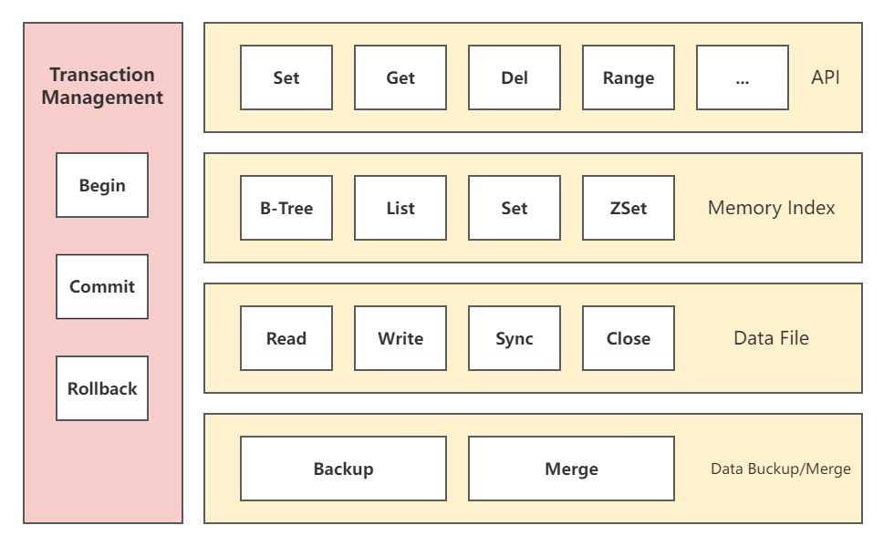

<p align="center">
    
</p>

<div class="column" align="middle">
  <a href="https://godoc.org/github.com/nutsdb/nutsdb"></a>
  <a href="https://goreportcard.com/report/github.com/nutsdb/nutsdb"></a>
  <a href="https://goreportcard.com/report/github.com/nutsdb/nutsdb"></a>
  <a href="https://codecov.io/gh/nutsdb/nutsdb"></a>
  <a href="https://raw.githubusercontent.com/nutsdb/nutsdb/master/LICENSE"></a>
  <a href="https://github.com/avelino/awesome-go#database"></a>
</div>

## What is NutsDB?

English | [简体中文](https://github.com/nutsdb/nutsdb/blob/master/README-CN.md)

NutsDB is a simple, fast, embeddable and persistent key/value store written in pure Go.

It supports fully serializable transactions and many data structures such as list、set、sorted set. All operations happen inside a Tx. Tx represents a transaction, which can be read-only or read-write. Read-only transactions can read values for a given bucket and a given key or iterate over a set of key-value pairs. Read-write transactions can read, update and delete keys from the DB.

We can learn more about NutsDB in details on the documents site of NutsDB: [NutsDB Documents](https://nutsdb.github.io/nutsdb-docs/)

## Announcement

* v1.0.0 release, see for details: [https://github.com/nutsdb/nutsdb/releases/tag/v1.0.0](https://github.com/nutsdb/nutsdb/releases/tag/v1.0.0)
* v0.14.3 release, see for details: [https://github.com/nutsdb/nutsdb/releases/tag/v0.14.3](https://github.com/nutsdb/nutsdb/releases/tag/v0.14.3)
* v0.14.2 release, see for details: [https://github.com/nutsdb/nutsdb/releases/tag/v0.14.2](https://github.com/nutsdb/nutsdb/releases/tag/v0.14.2)
* v0.14.1 release, see for details: [https://github.com/nutsdb/nutsdb/releases/tag/v0.14.1](https://github.com/nutsdb/nutsdb/releases/tag/v0.14.1)

📢 Note: Starting from v0.9.0, **defaultSegmentSize** in **DefaultOptions** has been adjusted from **8MB** to **256MB**. The original value is the default value, which needs to be manually changed to 8MB, otherwise the original data will not be parsed. The reason for the size adjustment here is that there is a cache for file descriptors starting from v0.9.0 (detail see https://github.com/nutsdb/nutsdb/pull/164 ), so users need to look at the number of fds they use on the server, which can be set manually. If you have any questions, you can open an issue.

After **nutsdb v1.0.0**, due to changes in the underlying data storage protocol, **the data of the old version is not compatible**. Please rewrite it before using the new version. And the current Bucket needs to be created manually. Please see the Bucket usage [documentation](./docs/user_guides/use-buckets.md) for details.

## Architecture



 Welcome [contributions to NutsDB](https://github.com/nutsdb/nutsdb#contributing).

## Quick start

### Install NutsDB

To start using NutsDB, first needs [Go](https://golang.org/dl/) installed (version 1.18+ is required).  and run go get:

```
go get -u github.com/nutsdb/nutsdb
```

### Opening a database

To open your database, use the nutsdb.Open() function,with the appropriate options.The `Dir` , `EntryIdxMode`  and  `SegmentSize`  options are must be specified by the client. About options see [here](https://github.com/nutsdb/nutsdb#options) for detail.

```go
package main

import (
    "log"

    "github.com/nutsdb/nutsdb"
)

func main() {
    // Open the database located in the /tmp/nutsdb directory.
    // It will be created if it doesn't exist.
    db, err := nutsdb.Open(
        nutsdb.DefaultOptions,
        nutsdb.WithDir("/tmp/nutsdb"),
    )
    if err != nil {
        log.Fatal(err)
    }
    defer db.Close()

    ...
}
```

## Documentation

<details>
  <summary><b>Buckets</b></summary>

- [Using buckets](./docs/user_guides/use-buckets.md)
</details>

<details>
  <summary><b>Pairs</b></summary>

- [Using key/value pairs](./docs/user_guides/use-kv-pair.md)
</details>

<details>
  <summary><b>Iterator</b></summary>

- [Iterating over keys](./docs/user_guides/iterator.md)
</details>

<details>
  <summary><b>Data Structures</b></summary>

- [List](./docs/user_guides/data-structure.md#list)
- [Set](./docs/user_guides/data-structure.md#set)
- [Sorted Set](./docs/user_guides/data-structure.md#sorted-set)
</details>

<details>
  <summary><b>Database Options</b></summary>

- [Options](./docs/user_guides/options.md)
</details>

<details>
  <summary><b>More Operation</b></summary>

- [More Operation](./docs/user_guides/others.md)
</details>

<details>
  <summary><b>Comparison</b></summary>

- [Comparison](./docs/user_guides/comparison.md)
</details>

<details>
  <summary><b>Benchmark</b></summary>

- [Benchmark](./docs/user_guides/benchmarks.md)
</details>

## Contributors

Thank you for considering contributing to NutsDB! The contribution guide can be found in the [CONTRIBUTING](https://github.com/nutsdb/nutsdb/blob/master/CONTRIBUTING.md) for details on submitting patches and the contribution workflow.

<a href="https://github.com/nutsdb/nutsdb/graphs/contributors">
  
</a>

## Acknowledgements

This package is inspired by the following:

- [Bitcask-intro](https://github.com/basho/bitcask/blob/develop/doc/bitcask-intro.pdf)
- [BoltDB](https://github.com/boltdb)
- [BuntDB](https://github.com/tidwall/buntdb)
- [Redis](https://redis.io/)
- [Sorted Set](https://github.com/wangjia184/sortedset)

## License

The NutsDB is open-sourced software licensed under the [Apache 2.0 license](https://github.com/nutsdb/nutsdb/blob/master/LICENSE).
